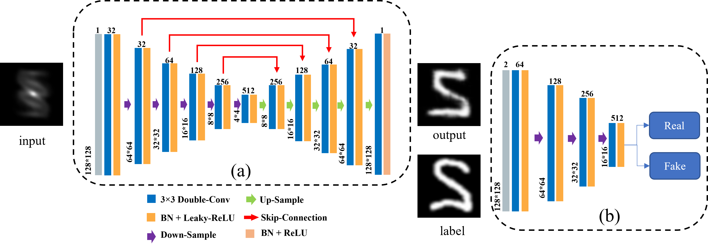

# GAN-PhaseRetrieval-MNIST

[Pytorch] A data-driven phase retrieval network based on [Pix2Pix](https://github.com/phillipi/pix2pix)

## Architecture

## Result
run `python run_predict.py`

## Train

<b>Test Environment:
* Python 3.9, Pytorch 2.1, CUDA 11.8

<b>Test Hardware:
* CPU i7-11800H, GPU Nvidia RTX 3060 Laptop, RAM DDR4 16G

Just run `python run_train.py` in terminal

Results (generated_images, state_dict() , loss_curve) while training will be saved in `./result/*`

## Data

MNIST and its autocorrelation generated by `fn_generate_dataset.py`

* MNIST_autocorr_test.pt: 

  shape:(1000, 1, 128, 128) type: float
* MNIST_autocorr_train.pt: 
  
  shape:(9000, 1, 128, 128) type: float

