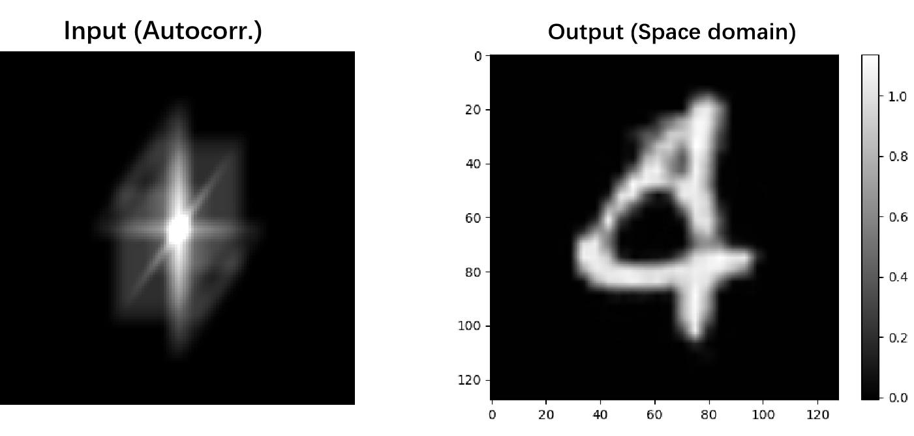
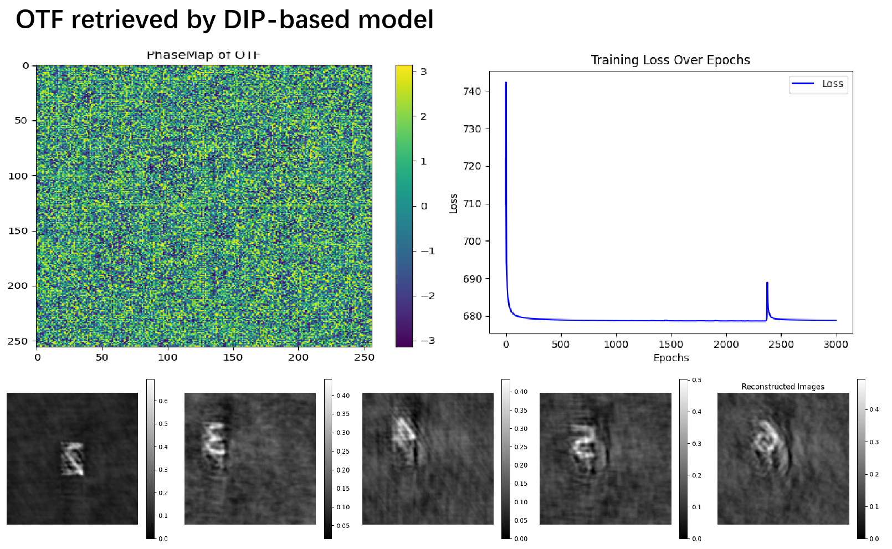
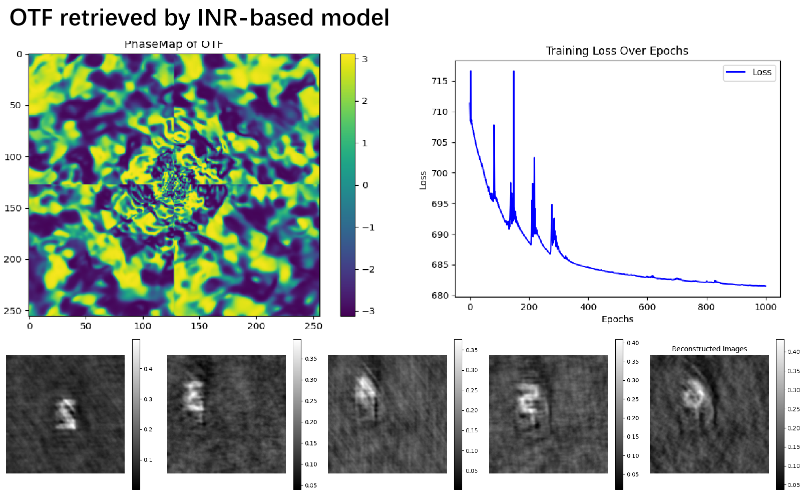

# Data-driven & Physics-informed Phase-Retrieval

## Arches
* **Pix2Pix**

  

* **Untrained Neural Network**
  
  

## Results

### Data-driven method

#### Example.1 \[Fienup Phase Retrieval\]Phase Retrieval with MNIST
* **Usage**

  Interference: run `python run_predict.py`

  Train: run `python run_train.py`

* **Result**

  
Model Interference

  
  

  
Training Model

  

### Physics-informed method

#### Example.2  \[Fienup Phase Retrieval\] Single-frame Phase Retrieval with Untrained-NN

* **Usage**

  run `python ./untrained/phase_retrieval.py`

* **Result**
  
  

#### Example.3  \[Scatter Imaging\] Single-frame OTF Retrieval with Real-speckle based [DIP](https://arxiv.org/pdf/1810.03982)&[INR](https://arxiv.org/abs/2006.09661)  Model
* **Usage**

  run `python ./untrained/otf_retrieval_with_DIP.py`

  run `python ./untrained/otf_retrieval_with_INR.py`
  
* **Result**

  

  

## Datas

### MNIST and its autocorrelation generated by `fn_generate_dataset.py`

* **MNIST_autocorr_test.pt**: 

  shape:(1000, 1, 128, 128) type: float
* **MNIST_autocorr_train.pt**: 
  
  shape:(9000, 1, 128, 128) type: float

### Real Speckles of scattering imaging 

* **/assets/*.bmp**
  
  Real speckle images of digits "2,3,4,5,6" captured in [Scattering Imaging Within Memory Effect](https://www.sciencedirect.com/science/article/abs/pii/S0143816623001446)

