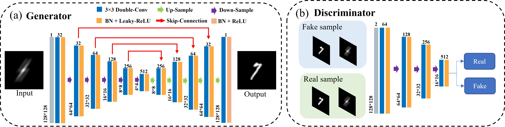
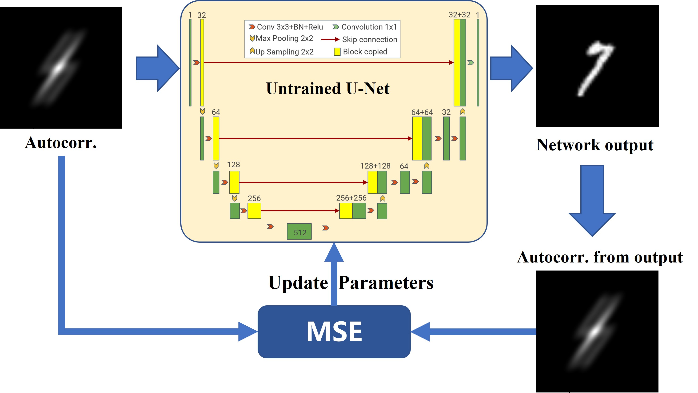
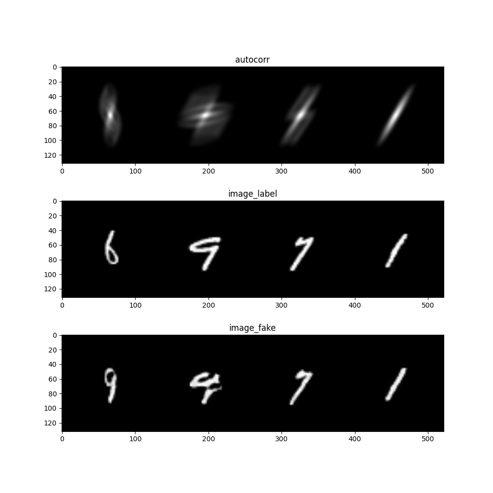
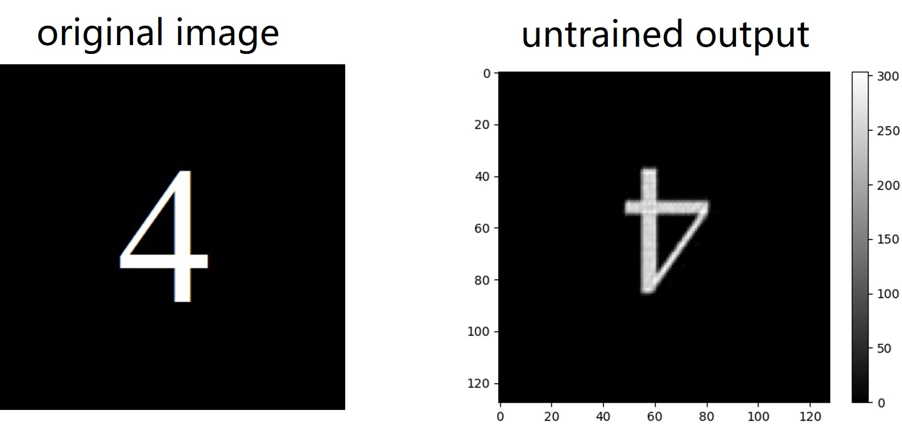
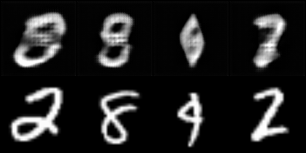

# PhaseRetrieval-MNIST

[Pytorch] Phase retrieval network based on [Pix2Pix](https://github.com/phillipi/pix2pix) and [Untrained Neural Network](https://github.com/FeiWang0824/PhysenNet)

## Architecture
* Pix2Pix

  

* Untrained Neural Network
  
  

## Result

* run `python run_predict.py`

  

* run `python ./untrained/phase_retrieval.py`

  

## Train

* Test Environment: Python 3.9, Pytorch 2.1, CUDA 11.8

* Test Hardware: CPU i7-11800H, GPU Nvidia RTX 3060 Laptop, RAM DDR4 16G

* For training with MNIST, just run `python run_train.py` in terminal. Results (generated_images, state_dict() , loss_curve) while training will be saved in `./result/*`

* For running with untrained method, run `python ./untrained/phase_retrieval.py`.

## Data

MNIST and its autocorrelation generated by `fn_generate_dataset.py`

* MNIST_autocorr_test.pt: 

  shape:(1000, 1, 128, 128) type: float
* MNIST_autocorr_train.pt: 
  
  shape:(9000, 1, 128, 128) type: float

